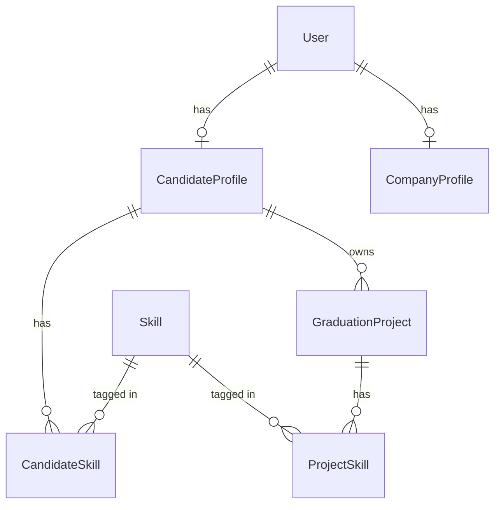

# Design Document — GradHub Platform (MVP)

## Overview

GradHub is a graduate-to-recruiter matching platform. Students publish profiles and graduation projects; recruiters browse and contact them. This document reflects the **2-week MVP scope** for a team of 4 developers with a progress submission in 2 days.

The codebase is a single Git repository with a decoupled ASP.NET Core Web API backend and a React SPA frontend.

```
GradHub-1/
├── GradHub.sln
├── GradHubDAL/          ← EF Core data layer
├── GRadHubBLL/          ← Business logic layer
├── GradHubPL/           ← Pure Web API
└── frontend/            ← React SPA (Vite + TypeScript)
```

---

## Phase Classification

### Phase 1 — MVP (Must Have)

| Feature | Why it's required |
|---|---|
| Authentication (Register / Login / JWT) | Nothing works without it. Every other feature depends on knowing who the user is. |
| Student Profile (view + edit + skills) | Core value proposition — this is what recruiters browse. |
| Recruiter Profile (view + edit) | Recruiters need a profile to exist in the system. |
| Graduation Projects (CRUD + skills) | The main content unit that recruiters search. Without it the platform is empty. |
| Skills Catalog (list) | Required for tagging projects and profiles. Seed the DB instead of building admin UI. |
| Browse / Search Projects (recruiter) | The recruiter's primary action. Without it there is no product. |

### Phase 2 — If Time Allows

| Feature | Why it's deferred |
|---|---|
| Messaging (conversations + replies) | Nice to have, but recruiters can contact students via the contact info on a profile. Implementing a real-time-feeling inbox is ~3–4 days of work. Can be added after MVP demo. |
| File Uploads (CV + thumbnail) | Adds infra complexity (file storage, MIME validation, path management). Contact links cover the gap. Defer until Phase 1 is stable. |
| Project publish/draft toggle | A simple boolean gate. Easy to add once core CRUD works, but not needed for demo day. |

### Phase 3 — Removed features for simplicity

| Feature | Why it's removed |
|---|---|
| Ratings | Adds two DB tables, recalculation logic, and UI just to show stars. No recruiter makes a hire decision based on a star rating from a fellow student. Zero value for V1. |
| Company Verification (`VerificationStatus`, `IsVerified`) | Implies an admin workflow that doesn't exist. Adds a field with no function. Remove it. |
| Admin role & admin endpoints | No admin UI, no admin user, no admin operations are planned. Remove `POST /api/skills` and `DELETE /api/skills/{id}` — seed skills in the DB. |
| Property-based tests (FsCheck) | 31 PBT tasks was never realistic for 2 weeks. Remove the test project entirely. Write zero tests unless a specific bug requires it. |
| `GradHub.Tests` project | Consequence of removing PBT. Not needed for the submission. |
| `UploadCvAsync` / `UploadThumbnailAsync` | File storage adds a surprising amount of complexity. Students can link to GitHub/LinkedIn instead. |
| AI Matching | Was never in the spec but sometimes mentioned informally. Do not build it. |
| Notifications | No mechanism (no SignalR, no push). Do not add. |

---

## Architecture

### System Layers

```
React SPA (frontend/)
    ↕ HTTP/JSON (JWT in Authorization header)
GradHubPL — ASP.NET Core Web API
    ↕ service interfaces
GRadHubBLL — Business Logic Layer
    ↕ IUnitOfWork + IGenericRepository<T>
GradHubDAL — EF Core
    ↕
SQL Server
```

### Project Responsibilities

| Project | Responsibility |
|---|---|
| **GradHubDAL** | EF Core DbContext, entity models, configurations, GenericRepository, UnitOfWork, migrations |
| **GRadHubBLL** | One service class per domain. All business rules and validation live here. |
| **GradHubPL** | API controllers, DTOs, middleware wiring (JWT, CORS, Swagger), `Program.cs`. No business logic. |
| **frontend/** | React SPA. Communicates with API via axios with a JWT interceptor. |

---

## Database — MVP Entities

Six tables. That's it.

### User
| Field | Type | Notes |
|---|---|---|
| Id | int PK | |
| FullName | string(100) | required |
| Email | string(150) | unique, required |
| PasswordHash | string | bcrypt hash |
| Role | string(20) | "Student" \| "Recruiter" |
| CreatedAt | DateTime | default GETDATE() |

No `Admin` role. No `VerificationStatus`. No `AverageRating`.

### CandidateProfile
| Field | Type | Notes |
|---|---|---|
| Id | int PK | |
| UserId | int FK → User | unique |
| Field | string(100) | CS/IT discipline, required |
| Bio | string(1000) | optional |
| ExperienceYears | int | default 0 |
| GraduationProjectLink | string? | URL |
| PortfolioLink | string? | URL |
| LinkedInLink | string? | URL |
| WhatsAppNumber | string? | |
| ContactEmail | string? | |
| CreatedAt | DateTime | default GETDATE() |

Removed: `CvFilePath`, `AverageRating`. Students share contact info directly — no file upload needed.

### CompanyProfile
| Field | Type | Notes |
|---|---|---|
| Id | int PK | |
| UserId | int FK → User | unique |
| CompanyName | string(150) | required |
| Industry | string(100) | required |
| Description | string? | optional |
| WebsiteLink | string? | URL |
| LinkedInLink | string? | URL |
| WhatsAppNumber | string? | |
| ContactEmail | string? | |
| CreatedAt | DateTime | default GETDATE() |

Removed: `VerificationStatus`, `IsVerified`, `AverageRating`.

### Skill
| Field | Type | Notes |
|---|---|---|
| Id | int PK | |
| Name | string(100) | unique, required |

Seeded via EF Core `HasData` — no admin CRUD endpoint needed.

### CandidateSkill
| Field | Type | Notes |
|---|---|---|
| Id | int PK | |
| CandidateProfileId | int FK → CandidateProfile | |
| SkillId | int FK → Skill | |
| Unique constraint on (CandidateProfileId, SkillId) | | |

### GraduationProject
| Field | Type | Notes |
|---|---|---|
| Id | int PK | |
| CandidateProfileId | int FK → CandidateProfile | cascade delete |
| Title | string(200) | required |
| Description | string(2000) | required |
| Category | string(100) | required |
| Status | string(20) | "Draft" \| "Published", default "Draft" |
| GitHubLink | string? | URL |
| LiveDemoLink | string? | URL |
| CreatedAt | DateTime | default GETDATE() |
| UpdatedAt | DateTime? | set on every update |

Removed: `ThumbnailPath` (no file upload in MVP).

### ProjectSkill
| Field | Type | Notes |
|---|---|---|
| Id | int PK | |
| GraduationProjectId | int FK → GraduationProject | cascade delete |
| SkillId | int FK → Skill | restrict delete |
| Unique constraint on (GraduationProjectId, SkillId) | | |

### Removed Tables
- `Rating` — Phase 3, removed entirely.
- `Conversation` — Phase 2, not in MVP.
- `Message` — Phase 2, not in MVP.

### Entity Relationship Diagram



---

## API — MVP Endpoints

All endpoints return `application/json`. Auth legend: 🔓 public, 👨‍🎓 Student only, 🏢 Recruiter only.

### Auth — `/api/auth`

| Method | Path | Auth | Description |
|---|---|---|---|
| POST | `/api/auth/register` | 🔓 | Register as Student or Recruiter |
| POST | `/api/auth/login` | 🔓 | Login, receive JWT |

**POST /api/auth/register**
```json
{ "fullName": "...", "email": "...", "password": "...", "role": "Student|Recruiter" }
```
Responses: `201 Created`, `400 Bad Request`, `409 Conflict` (email taken).

**POST /api/auth/login**
```json
{ "email": "...", "password": "..." }
```
Responses: `200 OK` with `{ "token": "...", "expiresAt": "..." }`, `401 Unauthorized`.

---

### Student Profile — `/api/students`

| Method | Path | Auth | Description |
|---|---|---|---|
| GET | `/api/students/me` | 👨‍🎓 | Get own CandidateProfile (includes skills) |
| PUT | `/api/students/me` | 👨‍🎓 | Update CandidateProfile |
| POST | `/api/students/me/skills` | 👨‍🎓 | Add skill by ID |
| DELETE | `/api/students/me/skills/{skillId}` | 👨‍🎓 | Remove skill by ID |

Removed: `POST /api/students/me/cv` (no file uploads in MVP).

---

### Graduation Projects — `/api/projects`

| Method | Path | Auth | Description |
|---|---|---|---|
| GET | `/api/projects` | 🏢 | Browse published projects (paginated, filterable) |
| GET | `/api/projects/{id}` | 🏢 | Get project detail with student contact info |
| POST | `/api/projects` | 👨‍🎓 | Create graduation project |
| GET | `/api/projects/me` | 👨‍🎓 | Get own projects |
| PUT | `/api/projects/{id}` | 👨‍🎓 | Update own project |
| DELETE | `/api/projects/{id}` | 👨‍🎓 | Delete own project |
| POST | `/api/projects/{id}/skills` | 👨‍🎓 | Add skill to project |
| DELETE | `/api/projects/{id}/skills/{skillId}` | 👨‍🎓 | Remove skill from project |

Removed: `POST /api/projects/me/thumbnail` (no file uploads in MVP).

**GET /api/projects** query params:
- `page` (int, default 1)
- `pageSize` (int, default 10, max 50)
- `category` (string, optional)
- `skillId` (int[], optional, multi-value)
- `search` (string, optional — matches Title or Description, case-insensitive)

---

### Recruiter Profile — `/api/recruiters`

| Method | Path | Auth | Description |
|---|---|---|---|
| GET | `/api/recruiters/me` | 🏢 | Get own CompanyProfile |
| PUT | `/api/recruiters/me` | 🏢 | Update CompanyProfile |

---

### Skills Catalog — `/api/skills`

| Method | Path | Auth | Description |
|---|---|---|---|
| GET | `/api/skills` | 🔓 | List all skills |

Skills are seeded in the DB. No admin create/delete endpoints in MVP.

---

### Removed Controllers

- `RatingController` — Phase 3, removed entirely.
- `MessagingController` — Phase 2, build after MVP.

---

## BLL Service Interfaces (MVP)

```csharp
// Auth
public interface IAuthService
{
    Task<AuthResultDto> RegisterAsync(RegisterDto dto);
    Task<AuthResultDto> LoginAsync(LoginDto dto);
}

// Student profile
public interface IStudentService
{
    Task<CandidateProfileDto> GetProfileAsync(int userId);
    Task<CandidateProfileDto> UpdateProfileAsync(int userId, UpdateProfileDto dto);
    Task AddSkillAsync(int userId, int skillId);
    Task RemoveSkillAsync(int userId, int skillId);
}

// Recruiter profile
public interface IRecruiterService
{
    Task<CompanyProfileDto> GetProfileAsync(int userId);
    Task<CompanyProfileDto> UpdateProfileAsync(int userId, UpdateCompanyDto dto);
}

// Graduation projects
public interface IProjectService
{
    Task<ProjectDto> CreateAsync(int userId, CreateProjectDto dto);
    Task<ProjectDto> UpdateAsync(int userId, int projectId, UpdateProjectDto dto);
    Task DeleteAsync(int userId, int projectId);
    Task<IEnumerable<ProjectDto>> GetMyProjectsAsync(int userId);
    Task AddSkillAsync(int userId, int projectId, int skillId);
    Task RemoveSkillAsync(int userId, int projectId, int skillId);
    Task<PagedResult<ProjectSummaryDto>> BrowseAsync(BrowseProjectsQuery query);
    Task<ProjectDetailDto> GetDetailForRecruiterAsync(int projectId);
}

// Skills catalog
public interface ISkillService
{
    Task<IEnumerable<SkillDto>> GetAllAsync();
}
```

Removed interfaces: `IMessagingService`, `IRatingService`.
Removed methods: `UploadCvAsync`, `UploadThumbnailAsync`, `CreateAsync`/`DeleteAsync` from `ISkillService`.

---

## GenericRepository Fix

The existing `IGenericRepository<T>` uses `Func<T, bool>` which pulls the full table into memory. Replace with `Expression<Func<T, bool>>` so EF Core translates it to SQL:

```csharp
// Fixed signature
IQueryable<T> GetAll(Expression<Func<T, bool>>? condition = null,
                     params Expression<Func<T, object>>[] includes);

// Implementation
public IQueryable<T> GetAll(Expression<Func<T, bool>>? condition = null,
                             params Expression<Func<T, object>>[] includes)
{
    IQueryable<T> query = _gradHubContext.Set<T>().AsNoTracking();
    foreach (var include in includes)
        query = query.Include(include);
    if (condition is not null)
        query = query.Where(condition);
    return query;
}
```

This is a prerequisite for all BLL implementations. Do it first.

---

## Frontend Structure (MVP)

```
frontend/src/
├── auth/
│   ├── LoginPage.tsx
│   ├── RegisterPage.tsx
│   └── authApi.ts
├── student/
│   ├── ProfilePage.tsx
│   ├── EditProfilePage.tsx
│   └── studentApi.ts
├── projects/
│   ├── ProjectFormPage.tsx
│   ├── MyProjectsPage.tsx
│   └── projectApi.ts
├── recruiter/
│   ├── RecruiterProfilePage.tsx
│   ├── BrowsePage.tsx
│   ├── ProjectDetailPage.tsx
│   └── recruiterApi.ts
└── shared/
    ├── components/     ← Navbar, ProtectedRoute, etc.
    ├── api/            ← axiosInstance with JWT interceptor
    └── types.ts
```

Removed folders: `messaging/` (Phase 2).

---

## Key Technical Decisions

### JWT

```json
{
  "Jwt": {
    "Key": "<256-bit secret>",
    "Issuer": "GradHubAPI",
    "Audience": "GradHubClient",
    "ExpiryMinutes": 60
  }
}
```

Claims: `sub` (userId), `email`, `role`.

### Password Hashing

`BCrypt.Net-Next` NuGet. No ASP.NET Identity.

```csharp
string hash = BCrypt.Net.BCrypt.HashPassword(password, workFactor: 12);
bool valid = BCrypt.Net.BCrypt.Verify(password, storedHash);
```

### CORS

```json
{ "AllowedOrigins": ["http://localhost:5173"] }
```

### Skill Seeding

Instead of building an admin API, seed skills directly in `OnModelCreating`:

```csharp
modelBuilder.Entity<Skill>().HasData(
    new Skill { Id = 1, Name = "C#" },
    new Skill { Id = 2, Name = "React" },
    new Skill { Id = 3, Name = "Python" },
    // ... 15–20 common skills
);
```

This eliminates the admin role, admin endpoints, and admin UI entirely.

### Global Exception Handling

Map BLL exceptions to HTTP status codes in a single middleware:

| Exception | HTTP Status |
|---|---|
| `NotFoundException` | 404 |
| `ConflictException` | 409 |
| `ForbiddenException` | 403 |
| `ValidationException` | 400 |
| Unhandled | 500 |

### Program.cs Wiring (PL)

```csharp
builder.Services.AddControllers();
builder.Services.AddAuthentication(JwtBearerDefaults.AuthenticationScheme)
    .AddJwtBearer(...);
builder.Services.AddCors(...);

// DI registrations
builder.Services.AddScoped<IUnitOfWork, UnitOfWork>();
builder.Services.AddScoped<IAuthService, AuthService>();
builder.Services.AddScoped<IStudentService, StudentService>();
builder.Services.AddScoped<IRecruiterService, RecruiterService>();
builder.Services.AddScoped<IProjectService, ProjectService>();
builder.Services.AddScoped<ISkillService, SkillService>();

app.UseExceptionHandler("/error");
app.UseCors("ReactApp");
app.UseAuthentication();
app.UseAuthorization();
app.MapControllers();
```

---

## Error Handling

### Standard Error Response

```json
{
  "status": 400,
  "message": "Validation failed",
  "errors": {
    "email": ["Email is already taken"]
  }
}
```

All BLL exceptions carry a message. `ValidationException` additionally carries a field-level `errors` dictionary.

---

## Correctness Properties (Reduced Set)

The full 31-property PBT suite is removed from scope. The following 8 behaviors are critical and should be manually verified during development:

1. Student registration creates `User` + `CandidateProfile`.
2. Recruiter registration creates `User` + `CompanyProfile`.
3. Duplicate email registration returns 409.
4. Login with wrong credentials returns 401.
5. JWT contains correct `sub`, `email`, `role` claims.
6. Role-based access returns 403 for wrong role.
7. Browse returns only `Status = "Published"` projects.
8. Project delete cascades to `ProjectSkill` records.
